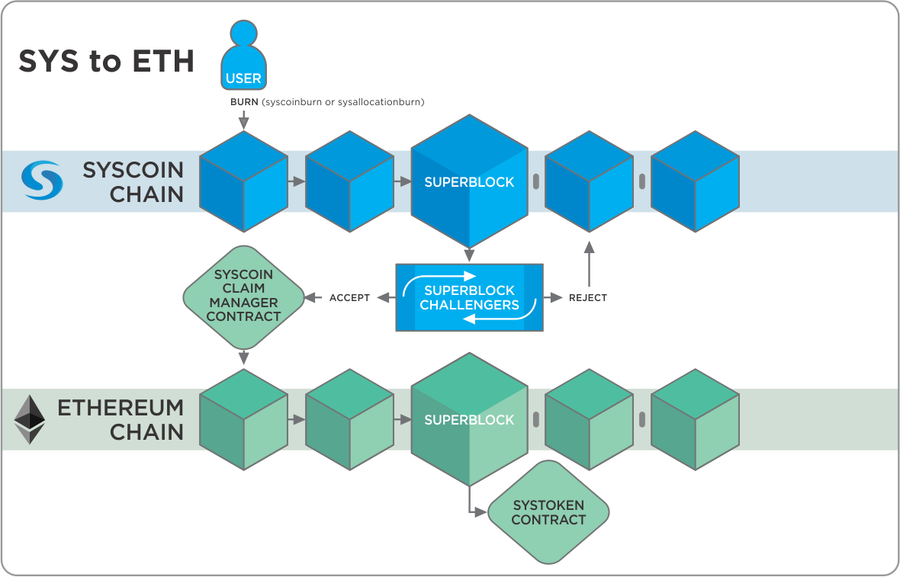
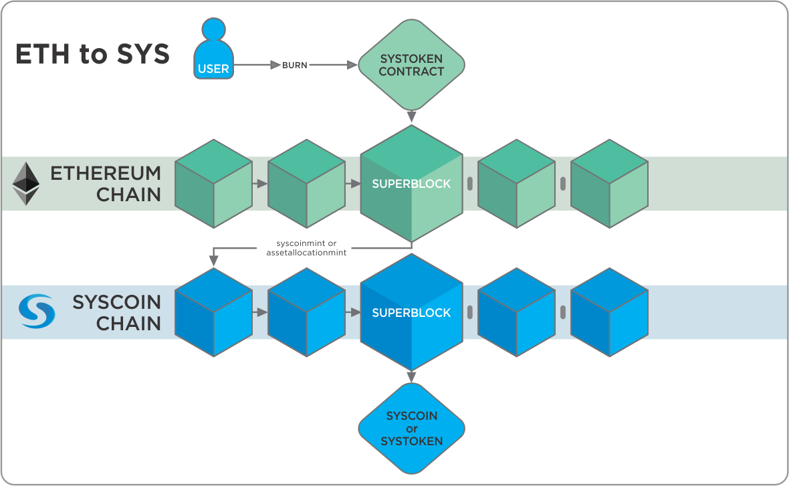

# Syscoin <=> Ethereum bridge docs

The Syscoin <=> Ethereum bridge is a system that allows Sys and Sys assets to be moved from the Syscoin blockchain to the Ethereum blockchain and back.


## Main subprojects
* [Sysethereum contracts](https://github.com/syscoin/sysethereum-contracts): Ethereum contracts.
* [Sysethereum agents](https://github.com/syscoin/sysethereum-agents): External agents.
* [Sysethereum Dapp](https://github.com/syscoin/sysethereum-dapp): UI Dapp for reference implementation.
## Sys to Eth



## Superblocks

The Sys -> Eth side uses a new concept we named Superblocks. Read the [white paper](superblocks/superblocks-white-paper.pdf).


## Eth to Sys



## Bridge

We implemented a "non-collateralized" solution for the Eth -> Sys side. Here are the core concepts:

* When a user wants to get sysx tokens, she has to send the sys to a Superblock contract which relays to a Token contract. The smart contract mints sysx tokens for the user. Assets on Syscoin are also done in similar way.
* When a user burns her sysx tokens, she has to wait for 240 confirmations and then create a mint transaction on Syscoin to request the sys back to the user.

## Actors

This is the list of external actors to the system and what they can do.

* User
  * Lock (Sys -> Eth).
  * Transfer sys tokens (Eth -> Eth).
  * Unlock (Eth -> Sys).
* Superblock Submitter
  * Propose superblocks.
  * Defend superblocks.
* Superblock Challenger
  * Challenge superblocks.


## Workflows
* New Superblock
  * There is a new block on the sys blockchain, then another one, then another one...
  * Once per hour Superblock Submitters create a new Superblock containing the newly created blocks and send a Superblock summary to [SyscoinClaimManager contract](https://github.com/syscoin/sysethereum-contracts/blob/master/contracts/SyscoinClaimManager.sol)
  * Superblock Challengers will challenge the superblock if they find it invalid. They will request the list of block hashes, the block headers, etc. Superblock Submitters should send that information which is validated onchain by the contract.
  * If any information provided by the Superblock Submitter is proven wrong or if it fails to answer, the Superblock is discarded.
  * If no challenge to the Superblock was done after a contest period (or if the challenges failed) the superblock is considered to be "approved". [SyscoinClaimManager contract](https://github.com/syscoin/sysethereum-contracts/blob/master/contracts/SyscoinClaimManager.sol) contract notifies [SyscoinSuperblocks contract](https://github.com/syscoin/sysethereum-contracts/blob/master/contracts/SyscoinSuperblocks.sol) which adds the Superblock to its Superblock chain.
  * Note: [SyscoinSuperblocks contract](https://github.com/syscoin/sysethereum-contracts/blob/master/contracts/SyscoinSuperblocks.sol) uses a checkpoint instead of starting from Syscoin blockchain genesis.
  * Note: [Sysethereum-Dapp](https://github.com/syscoin/sysethereum-dapp) was created with this workflow in mind in an automated native ReactJS application for convenience.

* Sending Syscoins to ethereum
  * User creates burn sys tx on the sys network using by calling `syscoinburn` or `assetallocationburn`.
  * The sys tx is included in a sys block and several sys blocks are mined on top of it.
  * Once the sys block is included in an approved superblock, the burn tx is ready to be relayed to the eth network.
  * The use sends an eth tx to [SyscoinSuperblocks contract](https://github.com/syscoin/sysethereum-contracts/blob/master/contracts/SyscoinSuperblocks.sol) containing: the sys burn tx, a partial merkle tree proving the sys burn tx was included in a sys block, the sys block header that contains the sys burn tx, another partial merkle tree proving the block was included in a superblock and the superblock id that contains the block.
  * [SyscoinSuperblocks contract](https://github.com/syscoin/sysethereum-contracts/blob/master/contracts/SyscoinSuperblocks.sol) checks the consistency of the supplied information and relays the sys burn tx to [SyscoinToken contract](https://github.com/syscoin/sysethereum-contracts/blob/master/contracts/token/SyscoinToken.sol).
  * [SyscoinToken contract](https://github.com/syscoin/sysethereum-contracts/blob/master/contracts/token/SyscoinToken.sol) mints N sysx tokens and assigns them to the User. Syscoin burn txs specify a destination eth address.


* Sending sysx tokens back to syscoin
  * User sends an eth tx to the [SyscoinToken contract](https://github.com/syscoin/sysethereum-contracts/blob/master/contracts/token/SyscoinToken.sol) invoking the `burn` function. Destination sys address, amount and asset id are supplied as parameters.
  * The User after waiting 240 confirmations on Ethereum creates, signs & broadcasts a sys mint tx using `syscoinmint` or  `assetallocationmint` depending if moving Syscoin or an asset on syscoin. 
  * The user receives the unlocked sys.

## Incentives

Some operations require gas to be spent or eth deposit to be frozen. Here are the incentives for doing that.

* Submitting a Superblock: Superblock submitters will get a fee when the superblock they sent is used to relay a tx. The Agent may connect to the local Geth node running alongside Syscoin. The account on the Geth node used by the Agent (configured in the conf file in the Agent settings) should be set to this account and unlocked on the Geth node.
* Superblock challenge: Challengers who find invalid superblocks will get some eth after the challenge/response game finishes.
* Each user will Syscoin txs to SyscoinSuperblock to go to Ethereum or calling the Burn function on the SyscoinToken to go back to Syscoin. The user is also responsible for paying the Syscoin network fees for creating burn and mint transactions on the Syscoin network.

## Description

SyscoinBattleManager [https://github.com/syscoin/sysethereum-contracts/blob/3a0293199040894167560c9ea3bd3bdf88c5853b/contracts/SyscoinBattleManager.sol] is Ethereum contract that evaluates responses to superblock challenges. The submitter of a superblock should respond to every challenge by providing specific information about the structure of the superblock. If the submitter is able to respond to all challenges, the superblock may become approved. Specifically, a superblock becomes semi-approved if there are any challenges in its history and such a superblock may become approved if three semi-approved superblocks are submitted on the top of it. Alternatively, a superblock becomes semi-approved if it is put on the top of another semi-approved superblock. A superblock may skip semi-approved state and become directly approved in case it is built on the top of approved superblock and no one challenged it.

A superblock is a representation of 60 blocks on Syscoin blockchain that is announced to Ethereum smart contract in order to later allow proving existence of burn transactions on Syscoin blockchain to Ethereum smart contract. In the Ethereum smart contract, superblocks are represented by the following structure [https://github.com/syscoin/sysethereum-contracts/blob/3a0293199040894167560c9ea3bd3bdf88c5853b/contracts/SyscoinSuperblocks.sol#L13]:
```
    struct SuperblockInfo {
        bytes32 blocksMerkleRoot;
        uint accumulatedWork;
        uint timestamp;
        bytes32 lastHash;
        bytes32 parentId;
        address submitter;
        bytes32 ancestors;
        uint32 lastBits;
        uint32 index;
        uint32 height;
        Status status;
    }
```

There are three verification steps in case of a superblock challenge that have to be executed in order: QueryMerkleRootHashes, QueryLastBlockHeader, and VerifySuperblock. 

When an honest agent detects a superblock which does not match with what the agent calculates locally, it challenges the superblock, which requires a proper response from the superblock submitter. The first challenge is QueryMerkleRootHashes and the submitter has to reply with respondMerkleRootHashes [https://github.com/syscoin/sysethereum-contracts/blob/3a0293199040894167560c9ea3bd3bdf88c5853b/contracts/SyscoinBattleManager.sol#L189]. In this response, the submitter simply provides all 60 hashes of the blocks that the superblock is supposed to represent. If the submitter does not provide this reply within 10 minutes, the challenger wins. If the response is submitted, SyscoinBattleManager verifies that the root of the Merkle tree built from the submitted 60 hashes equals to the value of blocksMerkleRoot in the superblock. It also checks that the last (and possibly an interim block see below) of the submitted block hashes is equal to the value of lastHash in the superblock. Notably, it also saves last two of the 60 provided block hashes for later use. If the response is successfully verified by the contract, the challenge continues. The interim block is one with index below 57, so block 0 to 57 may not connect with prev block hash == to the next block leading up to the last block header which is also fully verified. The challenger would verify that the chain of blocks connects up to the last block and if one doesn't connect the challenger provide that block to ensure that the submitter is honestly submitting a chain of blocks and no forks in between.
The logic is described of the interim block check below:
```
    syscoinchain: a-b-c-...-y-z
    attacker sb: a-b-c-D-e-f-G-h-i-...-y-z
    challenger looks from z down to a, first mismatch is G
    So the Challenger now asks the contract to ask for block h. If the attacker provides it, its previous block will be g, not G
```

The challenger continues by sending QueryLastBlockHeader challenge. The submitter has to reply with respondLastBlockHeader [https://github.com/syscoin/sysethereum-contracts/blob/3a0293199040894167560c9ea3bd3bdf88c5853b/contracts/SyscoinBattleManager.sol#L273] within 10 minutes again. In this response, the submitter provides a full block header of the last of the 60 blocks as well as potentially an interim block if the challenger gives a non-zero index of the block. SyscoinBattleManager calculates a hash of this block header and compares it to the stored hash of the last block from the previous step, which is equal to the value of lastHash in the superblock and similarily for the interim block. Then SyscoinBattleManager verifies that the submitted block headers have correct proof of work on them. If everything is okay, the challenge continues.

The challenger continues by executing the final step: VerifySuperblock. This consists of two steps. First, validateLastBlocks [https://github.com/syscoin/sysethereum-contracts/blob/3a0293199040894167560c9ea3bd3bdf88c5853b/contracts/SyscoinBattleManager.sol#L290] is called, in which SyscoinBattleManager should verify that the previous hash of the last block, which header was submitted in the previous step, is equal to the second from the last block hash submitted in the first step. The code is as follows:
```
    bytes32 blockSha256Hash = session.blockHashes[session.blockHashes.length - 1];
    BlockInfo storage blockInfo = session.blocksInfo;
    bytes32 prevBlockSha256Hash = session.blockHashes[session.blockHashes.length - 2];
    if(blockInfo.prevBlock != prevBlockSha256Hash){
        return ERR_SUPERBLOCK_BAD_PREVBLOCK;
    }
```
SyscoinBattleManager also verifies that previously submitted block header's timestamp and hash are equal to values of the superblock's timestamp and lastHash values. Finally, the timestamp of the superblock must not be lower than the timestamp of the previous superblock.

The second step of VerifySuperblock is validateProofOfWork [https://github.com/syscoin/sysethereum-contracts/blob/3a0293199040894167560c9ea3bd3bdf88c5853b/contracts/SyscoinBattleManager.sol#L326]. Here it is verified that the previously submitted block header's bits value (encoded target) is equal to the superblock's lastBits value. It is then checked that accumulated work value accumulatedWork of the superblock is bigger than the one of its parent. Then SyscoinBattleManager calculates a range of valid values for the block difficulty target in the last block of the superblock and compares that to the value of lastBits of the superblock. Finally, the accumulated work is calculated from the difficulty target value and compared to the claimed accumulatedWork value of the superblock. If all checks pass, the superblock submitter wins the challenge and can take challenger's deposit. Otherwise, if the challenger wins, it can take the submitter's deposit.

The challenges prevent the attacker to submit an invalid superblock.

## Assumptions
* Incentives will guarantee that there is always at least one honest Superblock Submitter and one honest Superblock Challenger online.
* There are no huge reorgs (i.e. 100+ block) in Sys nor in Eth blockchains

## Team

* [Jagdeep Sidhu](https://github.com/sidhujag)
* [Willy Ko](https://github.com/willyko)
* [Dan Wasyluk](https://github.com/dwasyluk)

## License

MIT License<br/>
Copyright (c) 2019 Jagdeep Sidhu <br/>
Copyright (c) 2018 Coinfabrik & Oscar Guindzberg<br/>
[License](LICENSE)
